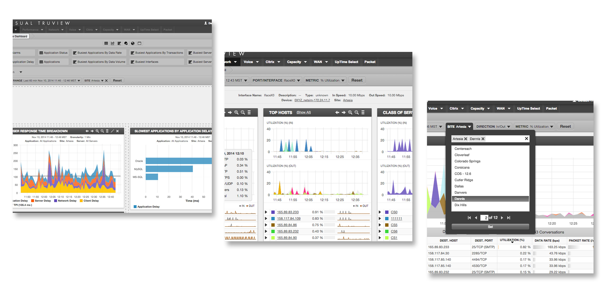
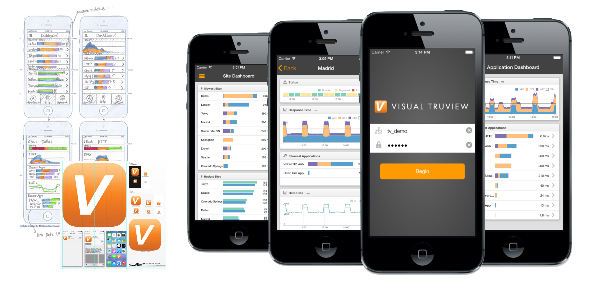
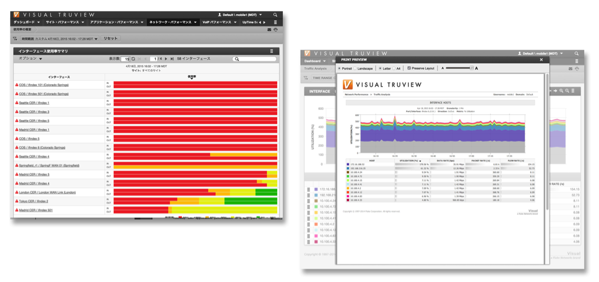
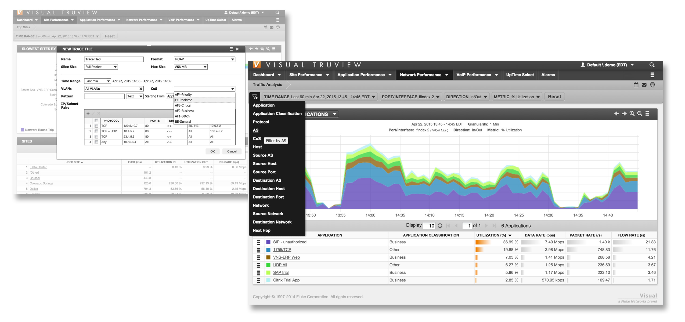
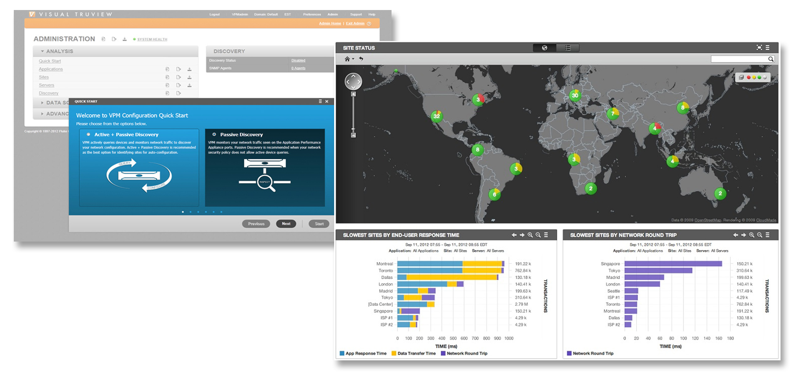
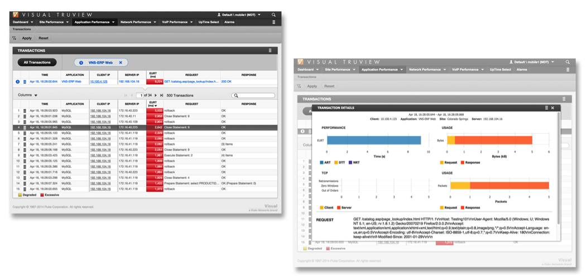
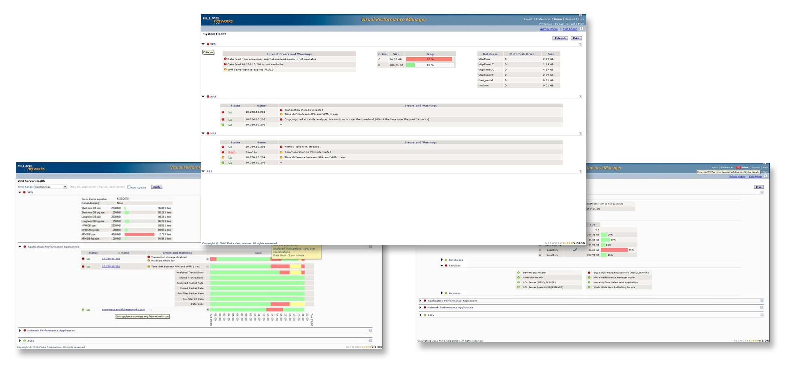
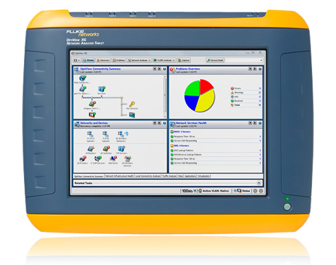

## Visual TruView 10.0

### September 2014 – May 2015

TruView is an application and network performance-monitoring tool that has been recognized by leading analyst firms and honored with several industry awards: TruView has been ranked as a leader in Gartner’s NPMD Magic Quadrant for 2 years in a row and was given the title of Best Hybrid AANPM Solution by Enterprise Management Associate’s Radar Report.

- Overhauled TruView’s navigation and interactions in order to create a consistent and comprehensive troubleshooting workflow. Added powerful and consistent interactions throughout the product to unlock the full potential of TruView’s analytics. Practiced top-down design by producing wireframes and creating rapid prototypes that drove the design.
- Crafted new page and panel level interactions and visualizations to promote troubleshooting within a single page context.
- Developed internal testing tools for validating new KPIs, regression testing, and different deployment scenarios.
- Created command line tools that simulated web clients and servers. These tools were used to simulate client, network, server, and application impairment.
- **Technologies/libraries** ExtJS, NodeJS, Express, Bootstrap, Angular, D3JS, CSS Transitions

## Visual TruView 9.5

### May 2014 – September 2014

- Designed and implemented the new multi-select filters and improved the usability of all filters by adding arrow key based navigation. Also added support for multi-select filters on custom pages and panels. By fleshing out TruView’s filtering abilities, the user gained industry-leading troubleshooting/reporting capabilities.
- Designed and developed parts the report creation and management user interface. Added backend support for creating reports in various time zones using NodeJS, Express, and MomentJS.
- Added new views and filters to support TruView’s newly enhanced Netflow analysis capabilities. These views included address pairs, AS (autonomous system) numbers, and network pairs. In combination with the multi-select filters, these views vastly expanded TruView’s visibility into enterprise network traffic.
- Managed all of the Translations work for Chinese and Japanese. Worked with sales partners in Japan to validate the translated user interface.
- **Technologies/libraries** ExtJS, NodeJS, Express, MomentJS, PhantomJS, I18Next

  ## Next-gen TruView (Architecture prototype)

  ### April 2014 – May 2014

- Sole UI engineer on a 5-person team in charge of designing the next generation architecture for TruView.
- Moved TruView’s web tack from ASP.NET/IIS to the MEEN stack (MongoDB, Express, ExtJS, NodeJS) + Nginx.
- Made a working prototype of the new AA architecture (Authentication, Authorization, and Accounting – minus the Accounting) using PassportJS and Connect middleware. Added support for LDAP authentication via passport-ldapauth and basic auth support for API routes. Documented a forward thinking AAA architecture that took into consideration platform APIs, LDAP, oAuth, SSO, and FNetID (Fluke Networks’ own user management service).
- Developed a client-side utility library built on top of MomentJS to calculate time ranges in various time zones.
- Architected the NodeJS bootstrapping process, including the way in which internal/and external routes were initialized.
- Designed and documented various new architectures for multiple areas including multi-tenant MongoDB support and SOA based refactoring of TruView’s NodeJS based services.
- **Technologies/libraries** NodeJS, Express, MongoDB + Mongoose, PassportJS, MomentJS, Grunt + plugins

## TruView Mobile

### September 2013 – April 2014

Created the first AANPM/NPMD mobile application for iOS. With TruView Mobile, customers can securely access critical application and network performance data from anywhere, even outside of their enterprise network.

- Sole engineer responsible for this project – planning, designing, architecting, and implementing the application from the ground up.
- Created a custom communication protocol that allows TruView customers to securely access their private data center data from outside of their company's firewall.
- Introduced server-side JS unit testing to our CI builds and pioneered the use of BDD throughout the product.
- **Technologies/Libraries** Sencha Touch, Cordova, NodeJS, Express, PubNub, ParseJS, Async, CryptoJS, Couch DB, D3JS + SVG, CSS Animations, RequestJS,
- **Testing libraries** Mocha, Chai, Karma, Sinon, Istanbul, Grunt
  ## Visual TruView 8.3
  ### Summer 2013 - September 2013
  
- Refactored both TruView’s client side and server side code to support localization via i18next. Made TruView automatically switch languages based on the user’s accept language. Designed the JSON schema for the localized strings.
- Helped add PDF print support to all pages. Created a clean print style and consulted on page scaling and page break algorithms.
- Designed and developed XML parameter filtering for transactions to satisfy requests from Chinese customers.
- **Technologies/Libraries** PhantomJS, SASS with media queries, ExtJS, i18next, NodeJS, ExpressJS
  ## Visual TruView 8.1
  ### Spring 2013 – Summer 2013
  
- Designed and developed TruView’s new ad-hoc trace file functionality that enabled users to create sophisticated filters in order to retrieve meaningful trace files from anywhere in the product. Designed the RESTful APIs to support the numerous trace file filters.
- Re-architected the UI to be responsive (The UI was previously fixed width). Refactored all pages to have consistent filtering components. The new filtering components empowered the user with the ability to add numerous filters to a given page.
  ## Visual TruView 8.0
  ### 2012
  
- mplemented TruView’s “auto-configuration” functionality with simplicity and re-usability in mind. With TruView’s auto-configuration feature (also named QuickStart), customers were able to configure the system and start seeing data in the UI in less than 5 minutes. This feature greatly improved TruView’s demo-ability, which in turn helped TruView’s sales engineers during POCs (proof of concepts).
- Re-architected various admin views using REST. Created re-usable components (editable grids, RESTful fields, Admin Toolbars, Status Widgets, Info Bars etc.) to support future admin work.
- Created a standard page architecture for TruView’s admin views (multi-module publishing, change caching, config file import and export).
- Designed and styled TruView’s site map feature. Designed the UX for site clustering and other panel level interactions.

## Visual Performance Manager 7.0

### 2011

- Completely overhauled VPM’s transaction retrieval UI – known as the transaction viewer. Created support for a variety of filters and created a SPA (single page application) workflow to investigate N-tier issues.
- Did extensive usability studies on VPM’s transaction viewer in order to ensure a superior user experience. Used speak-out-loud testing, user-centered design, remote usability testing, and other UX concepts and practices to gather feedback.
- Helped design and implement VPM’s Site Details page, creating many new UI components in the processes. In particular, I was a core designer and developer for VPM’s filtering mechanism that took into account data granularity, time zones, formatting, and client-side validation.

  ## Visual Performance Manager 6.9

  ### 2010

  

- Primary designer and programmer for VPM’s system health feature. Implemented the new user interface and created the new mechanisms for data insertion and retrieval.
- Added support for URI based layer 7 applications to VPM’s packet analyzer.
- Made UI improvements for application and site configuration pages using JQuery and ASP.NET.
- Technologies/Libraries: ASP.NET, JQuery
  ##OptiView XG

  ### 2009

  

- Worked alongside senior engineers on OptiView’s next-gen UI framework as well as OptiView’s configuration views (Java).
  ##Spectrum Analyzer Prototype
  ### Fall 2008
- Created a working prototype for what was going to be Fluke Networks’ next-gen spectrum analyzer. Worked on a 2-man team that delivered a prototype that fully exercised a brand new spectrum analysis card (Java).
