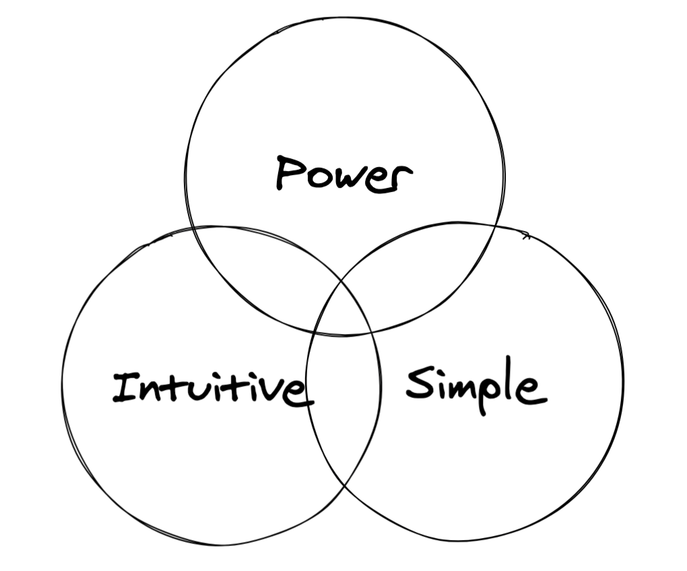

As most designers and engineers know, creating a product that is simple, intuitive, and powerful is the holy grail of the tech industry. Building a product that melds these 3 crucial elements is not easy - it takes a lot of iterations and interactions with users to nail down an elegant design. It is thus no surprise that user experience and design is getting an increasing amount of emphasis across the industry.
Troubleshooting applications are particularly hard to design due to the immense scale of the problem domains that they deal with (some examples of these problem domains include networking and security). In troubleshooting, the end goal of a user is quite simple; a user either wants to figure out the root cause of a problem or to figure out that the problem is not their responsibility. But problems many times have the following complexities:

- Numerous small problems accumulate to a large problem
- Problems can be extremely sporadic
- Small problems can mask larger problems

These complexities make designing a troubleshooting product difficult. Below are a few ideas that may help drive the design of a product that ultimately is able to marry both intuitiveness and power.
##1. Create problem domain based KPIs
As mentioned above, users of troubleshooting applications want to do one of two things: identify the root cause of a problem or identify that the problem is not theirs. Users of troubleshooting applications usually have a specific domain of expertise or responsibility. For example, in network troubleshooting, you have network engineers and application owners. Many times network engineers will want to use a network troubleshooting tool that not only identifies network problems but that will also show that a problem is due to an ill-performing application (and vice versa for the application owners). So what is a problem domain based KPI (Key Performance Indicator)? It is simply a user-centric measurement that a particular domain owner would care about. A problem domain based KPI helps domain owners do their jobs by identifying whether they need to investigate a problem. These KPIs also let domain owners measure the relative severity of various problems. Identifying the various problem domains your product will tackle will help you identify the type of KPIs that your product will have to provide.
It may sound strange that KPIs are given such a strong emphasis here. Some may confuse this with bottom up design (a.k.a. letting the data drive the design rather than the design dictate the data). There are two major reasons why identifying a product’s KPIs is so critical:

- Without good KPIs, there is no product. KPIs are what will drive the workflows of a product. Without an understanding the KPIs (a.k.a. the problem domains), the workflows for the product cannot be created.
- By forming the KPIs around the users’ problem domains, we are putting the user’s needs first. Be careful to not design KPIs based on the data that you simply know is available. This will inevitably produce a product that is hard to understand for the end-user since they have little to no understanding of the underlying data.
  In order to have a powerful product, you need to have well-formed data that your users will care about. Start simple (a.k.a. Is there a single metric that can reflect the issues in a problem domain?) then add finer grain KPIs and sub metrics to add context to your primary KPIs.

## 2. Filters with varying scope

Every troubleshooting application contains some sort of filtering capability, whether it is simply a time range selector or a rich set of configurable options. The problem with many troubleshooting applications is that they have too little or too much filtering capability. So how do you decide what filters to add?
Each filter that you add to an application or page should be tied to a specific user scenario. For example, you may want to add a location filter if you know that a regional manager will want to troubleshoot a particular geographic area. Conversely, do not add a location filter if location does not help the end-user troubleshoot a problem. Just because the underlying data contains a field or column for location does not mean that the UI needs to have a filter for it.
Troubleshooting filters should have a variety of scope; some filters should have a very tight scope while others should have a broad scope. By providing filters with varying scope, the user will gain the power to be able to view the data from various angles. Take the location filter for example; a product may benefit from having a city filter (tight scope) as well as a region filter (broad scope).
Lastly, it is important that your product's filtering behavior is consistent across data sources and pages. Whether you are looking at a grid of data for domain A or a trended graph of domain B, the filtering behavior should be the same and the resulting UI should reflect that a filter has been applied to the data set. While this may seem like a backend concern, consistent data models result in consistent behavior. It is in these situations where it is abundantly clear that UX is the concern of the full team. If filters are kept consitant across pages and data sources, the user will be able to "collect" filters as s/he troubleshoots, narrowing the problem domain as s/he goes.
##3. Problem-isolating data visualizations
Good data visualizations are so critical to a good troubleshooting workflow that I will not attempt to describe all the details here. However a few things need to be kept in mind when building data visualizations:

- Accentuate the problem domain based KPIs. By doing so, your product's troubleshooting pages will gain a distinct purpose. Natural workflows emerge when you visualize useful metrics in the right way.
- Make use of baselines and thresholds. Users want to know how bad a problem is. Once baselines and thresholds are established, features like alarms and notifications will naturally emerge.
- Use visualizations that make problems bubble to the top. Depending on the visualization, the scales used, and the presence of sporadic anomalies, problems can get hidden in plain sight. However if you use or combine multiple types of visualizations, it can help the user find problematic behavior more easily.
- Add interactivity. Interactivity puts the power in the user’s hands. For example, you may want the user to be able to click on a stacked bar chart to isolate a particular KPI. Or you may want to allow users to add filters by simply clicking on a bar that they are interested in. Creating consistent and useful interactions to your visualizations can make troubleshooting tools extremely powerful and more intuitive to use.

## 4. Add rich page level interactions and tools

Just like how a carpenter has a belt of tools, your application should have a group of tools that are available on every page. When adding new functionality to a product, think about whether the feature you are adding would be useful throughout the product. For example, you may want to add printing and emailing to your application. Since this feature would be useful on all views, this would be a prime candidate to be added as a tool.
Another criteria that may indicate that a feature should be a tool is if it is important for the user to be able to maintain the page that they are currently looking at. Tools should be implemented as modals, slide outs, or some other UI paradigm that doesn’t take the user away from their troubleshooting context. For example, when adding new metrics to a product, you may want to consider adding them as overlays to various other charts. This could add immence value to the product because it not only puts more control into the user's hands but it also allows the user to solve complex problems within a single page's context.

## 5. Design converging workflows

Your product may have many different types of users; Some may be more tech savvy and some may be new to their domain. While personas can be very useful when trying to design different pages and features, it is worth following a simple pattern that all users can relate to. In the case of troubleshooting, there are two main scenarios you need to cover: The user wants to investigate a particular domain or the user does not know that a problem exists and needs to discover emerging issues. I many times call these two different workflows or app states “Active Troubleshooting” and “Passive Monitoring.” The key point here is that the Passive Monitoring workflows should always flow into an Active Troubleshooting workflows. Passive Monitoring pages usually take the form of dashboards or pages that highlight emergent or problematic behaviors. These pages should auto-update at a regular interval and should use visualizations and components that make issues bubble to the top (Think sorted lists and tops charts) These visualizations and components should also have interactions that flow into a particular active troubleshooting workflow. For example, in a network troubleshooting application, if a user is passively monitoring the status of a group of servers, the application should have a built in interaction to enable the user to dive into a particular server’s active troubleshooting workflow when a problem becomes apparent.

## Final thought

The above ideas are a result of being a part of the UI/UX team for a AANPM (Application-Aware Network Performance Monitoring) application for the past 4 years. If any of the ideas presented resonate with your work (or do not), please don't hesitate to contact me. Happy coding!
